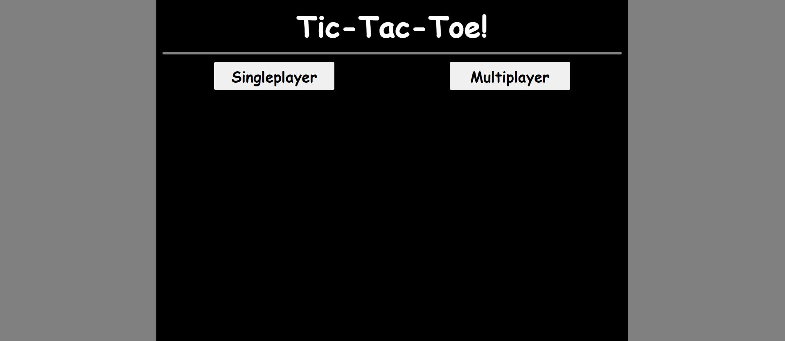
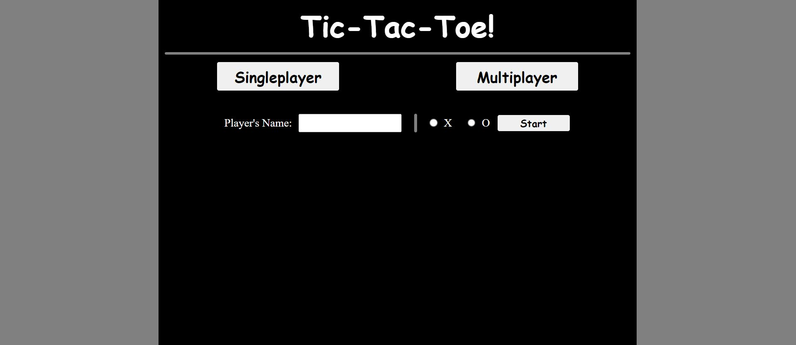
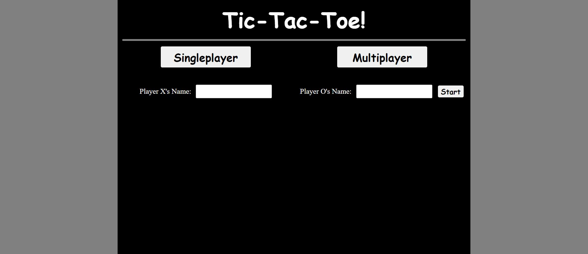
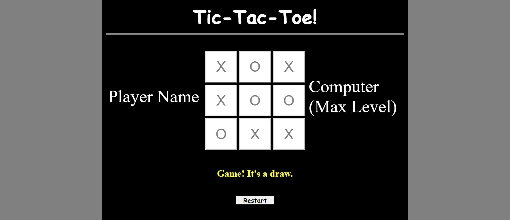
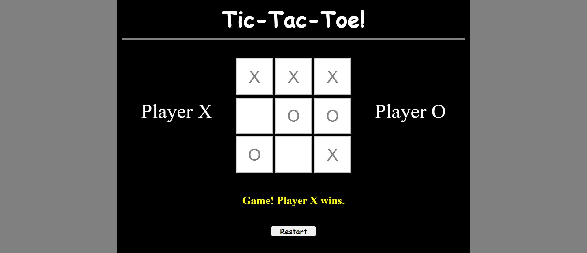

# odin-Tic-Tac-Toe

## Singleplayer-Multiplayer Tic Tac Toe Game

This project is part of [The Odin Project's](https://www.theodinproject.com/dashboard) JavaScript chapter in the Fullstack JavaScript path. The project features:

* Singleplayer and Multiplayer modes.

* The Singleplayer mode is a match between the player and the computer. It uses a Minimax algorithm (coded from scratch in JavaScript) to find the optimal play in every round.

* The Multiplayer mode is a standard player .vs. player game.

I studied the Minimax algorithm from [CS50AI](https://cs50.harvard.edu/ai/2024/) in week 0. While they use Python in the course, the concepts carry over to any language.

The result of the game is declared below the board.

## Demo
Check the demo [here](https://mathoverse100.github.io/odin-Tic-Tac-Toe/).

## Screenshots

## License

MIT License

Copyright (c) 2020 The Odin Project

Permission is hereby granted, free of charge, to any person obtaining a copy of this software and associated documentation files (the "Software"), to deal in the Software without restriction, including without limitation the rights to use, copy, modify, merge, publish, distribute, sublicense, and/or sell copies of the Software, and to permit persons to whom the Software is furnished to do so, subject to the following conditions:

The above copyright notice and this permission notice shall be included in all copies or substantial portions of the Software.

THE SOFTWARE IS PROVIDED "AS IS", WITHOUT WARRANTY OF ANY KIND, EXPRESS OR IMPLIED, INCLUDING BUT NOT LIMITED TO THE WARRANTIES OF MERCHANTABILITY, FITNESS FOR A PARTICULAR PURPOSE AND NONINFRINGEMENT. IN NO EVENT SHALL THE AUTHORS OR COPYRIGHT HOLDERS BE LIABLE FOR ANY CLAIM, DAMAGES OR OTHER LIABILITY, WHETHER IN AN ACTION OF CONTRACT, TORT OR OTHERWISE, ARISING FROM, OUT OF OR IN CONNECTION WITH THE SOFTWARE OR THE USE OR OTHER DEALINGS IN THE SOFTWARE.